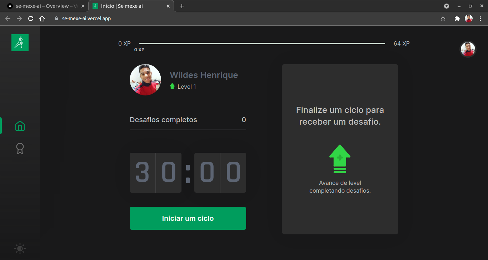
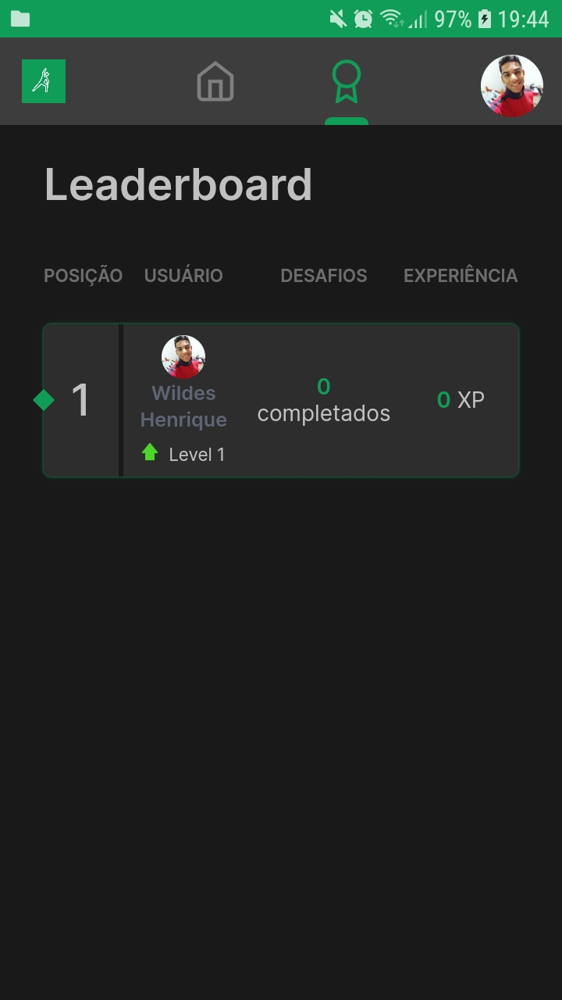

<p align="center">
  
</p>

<p align="center">
        
</p>

<h1 align="center">
       
       
</h1>

<br>

## 🧪 Tecnologias

Esse projeto foi desenvolvido com as seguintes tecnologias:

- [React](https://reactjs.org)
- [Firebase](https://firebase.google.com/)
- [TypeScript](https://www.typescriptlang.org/)
- [Sass](https://github.com/sass/sass)
- [Next.js](https://nextjs.org/)

## 🚀 Como executar

Clone o projeto e acesse a pasta do mesmo.

```bash
$ git clone https://github.com/WildesPiva/se-mexe-ai
$ cd se-mexe-ai
```

Para iniciá-lo, siga os passos abaixo:
```bash
# Instalar as dependências
$ yarn

# Iniciar o projeto em desenvolvimento
$ yarn dev
```
O app estará disponível no seu browser pelo endereço http://localhost:3000.

Lembrando que será necessário criar uma conta no [Firebase](https://firebase.google.com/) e um projeto para disponibilizar um Realtime Database.

## 💻 Projeto

O "Se mexe ai" é um app que une a técnica de Pomodoro com a realização de exercícios físicos para quem passa muito tempo na frente do computador. 

Hoje está hospedada na vercel https://se-mexe-ai.vercel.app

Este é um projeto que foi o Next Level do  desenvolvido durante a **[Next Level Week Together 4](https://nextlevelweek.com/)** da [**Rocketseat**](https://rocketseat.com.br/). Implementei funcionalidades extras de armazenamento dados, autenticação e tornei a applicação responsiva.


Feito com por Wildes Piva
